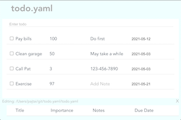
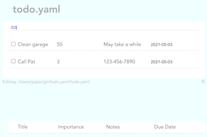
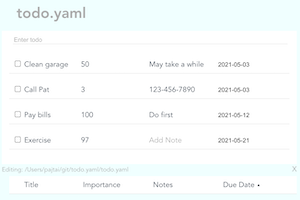

# todo.yaml

> A flexible, configurable, and file-based todo tracker.

A GUI for your todo.yaml file.

## Why?

If you have a todo.yaml, you can already edit it in your favorite editor, but gratuitous GUIs are always nice.

## Getting started

CD into the directory that has your `todo.yaml` file. If there is no `todo.yaml` in the directory, one will be created for you.

You can configure your todo.yaml when the file is created, and you can configure it later by running `todo configure`. The configuration lives in the todo.yaml file itself under the `configuration` key/

## Commands

_Square brackets indicate an optional arguments._

| Command | Description |
| --- | --- |
| `todo [file-name]` | Opens the todo GUI. Creates and configures a `todo.yaml` file in the cwd if one doesn't already exist. Opens the GUI for editing the todo.yaml file at http://0.0.0.0:8080/. If no file name is specified, a choice of yaml files in the directory is given. If there are no yaml files in the directory, the name of the yaml file to be created can be entered. The file name must have a `.yaml` suffix. |
| `todo.yaml`                       | Alias for todo |
| `npx todo.yaml`                   | Runs todo without globally installing todo.yaml |
| `todo configure [file-name.yaml]` | Configure the todo.yaml in the cwd |
| `todo c`                          | alias for todo configure` |
| `todo --version`                  | Show the version` |
| `todo -V`                         | alias for todo --version` |

If present, clicking on the title, importance, or due date column headers can be used to resort the items.

To add a todo, type it into the input and hit enter.

To search and visually filter all todos across all columns enter a string into the input that begins with `/`. 





## Configuration

To interactively configure your `todo.yaml`, run `todo configure`. 

The interactive configuration will automatically set the following for you based on your choices:

- `addTodosToTop` Option to add new todos at the top of the list vs the bottom
- `saveCompleted` Option to save completed todos
- `shuddownServerButton` Option to add an `X` button in the lower right of the GUI that will close the window and shutdown the server  
- `columns: dueDate` Option to track due dates
- `columns: importance` Option to track importance via a number
- `columns: notes` Option to add notes to items

### Try it

```shell
npx todo.yaml
```

### Install it

```shell
npm i -g todo.yaml
```

## Format

The todo.yaml has the following format:

```yaml
todo:
    - item 1
    - item 2
configuration: saveCompleted
done:
    - done item 1
    - done item 2
```

## Tips and Tricks

### Manual Editing

-   When editing the todo.yaml by hand, you can add in new todo items as strings. They will automatically be turned into objects the next time the api interacts with them.
-   You can edit the configuration file interactively via `todo configure` or manually in your todo.yaml

### GUI Editing

-   Double click to edit a todo title.

### Syncing

-   You can use Dropbox or other methods to sync your todo.yamls between desktop and mobile.
- Do you want to share you TODO with the world? `npx localtunnel --port 3000`


### Organization

-   You can use as many todo.yaml files as you want. Just make sure each is in its own directory.

## Dev Workflow

```shell
git clone git@github.com:pajtai/todo.yaml.git
npm run dev
```

To install pre-commit hooks:

```shell
npm set-script prepare "husky install" && npm run prepare
```

## TODO Suggestions

It's your `todo.yaml` file, so, obviously, do as you wish, but I've noticed the following:

Track only important todos. The other items take care of themselves.

Some people say it's a good idea to write down ALL your todos, since there is a cost to keeping them in your head. The flip side of this is that writing a todo down gives it a life of its own. If you write down all your todos, the trivial ones will flood the important ones. It's probably better to only track certain todos.

Don't be afraid to delete todos.

I think people have a built-in aversion to loss and missing out. This causes our todos to accumulate more and more items until the important items are flooded by the trivial items. It's a good idea to delete old todos that you're not going to do.

## Roadmap

Obviously, it's a [`todo.yaml`](roadmap/todo.yaml)!
